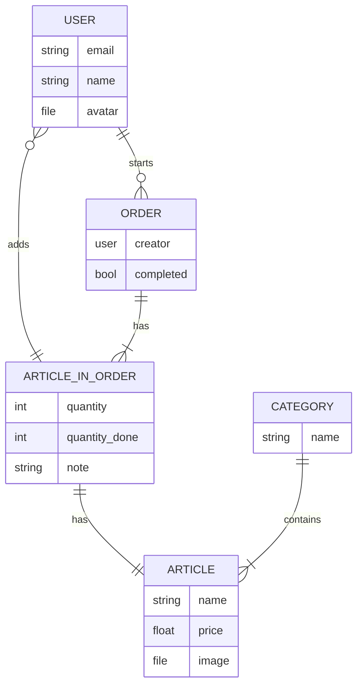

# snacctime

## Roadmap
- [x] Set up PocketBase
- [x] Create basic database layout (might need some tweaks)
- [ ] Create tables in PocketBase
- [ ] Setup login and user creation
- [ ] Setup CI/CD for android builds
- [ ] Setup basic app functionality
    - [ ] Create orders
    - [ ] Add articles to orders
    - [ ] Complete Orders
- [ ] Release V1 :tada:

## Database Layout

