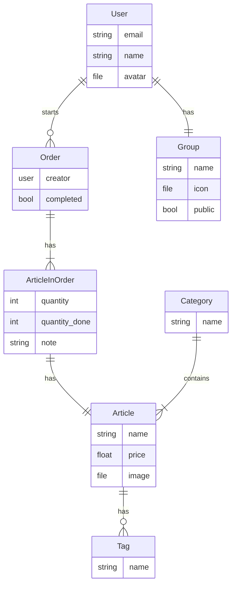

# Snacctime

> [!warning]
> This project is very much in early development right now.
> There is currently no stable release yet and there will be lots of breaking changes!

## Roadmap
- [x] Set up PocketBase
- [x] Create basic database layout (might need some tweaks)
- [x] Create tables in PocketBase
- [x] Setup login
- [ ] Setup user creation
- [ ] Setup CI/CD for android builds
- [ ] Setup basic app functionality
    - [x] Create orders
    - [ ] Add articles to orders
    - [ ] Complete Orders
- [ ] Release V1 :tada:

- [ ] Add Grouping system
- [ ] Add Room information

## Design Philosphy
- Text:  `#EAE9FC`
- Background:  `#140047`
- Primary:  `#FCAD64`
- Secondary:  `#020024`
- Accent:  `#FF808E`
  
[RealtimeColors pallette](https://www.realtimecolors.com/dashboard?colors=eae9fc-140047-fcad64-020024-ff808e&fonts=Poppins-Poppins)

## Database Layout

