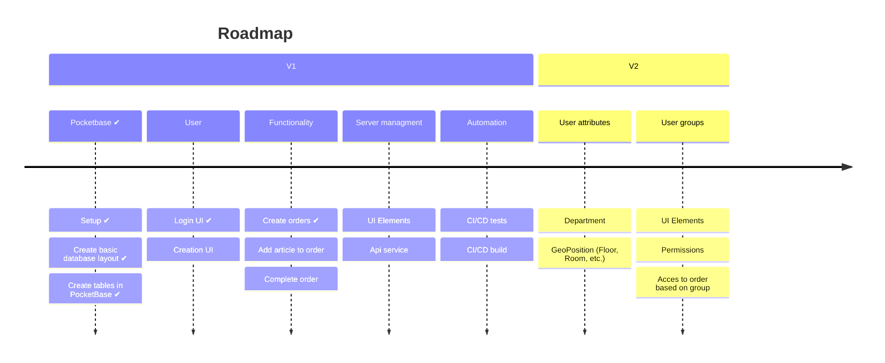
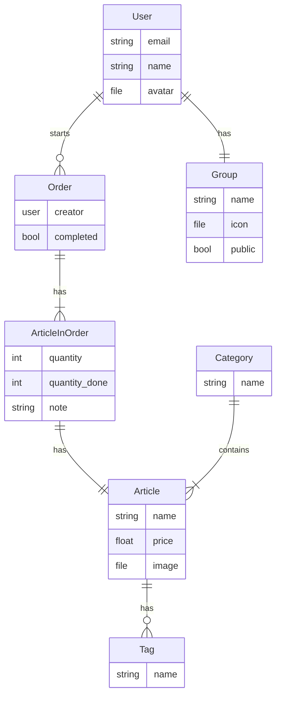

# Snacctime

> [!warning]
> This project is very much in early development right now.
> There is currently no stable release yet and there will be lots of breaking changes!

## Roadmap

## Design Philosphy
- Text: `#EAE9FC` $\textcolor{#EAE9FC}{⬤}$
- Background: `#140047` $\textcolor{#140047}{⬤}$
- Primary: `#FCAD64` $\textcolor{#FCAD64}{⬤}$
- Secondary: `#020024` $\textcolor{#020024}{⬤}$
- Accent: `#FF808E` $\textcolor{#FF808E}{⬤}$
  
[RealtimeColors pallette](https://www.realtimecolors.com/dashboard?colors=eae9fc-140047-fcad64-020024-ff808e&fonts=Poppins-Poppins)

## Database Layout

