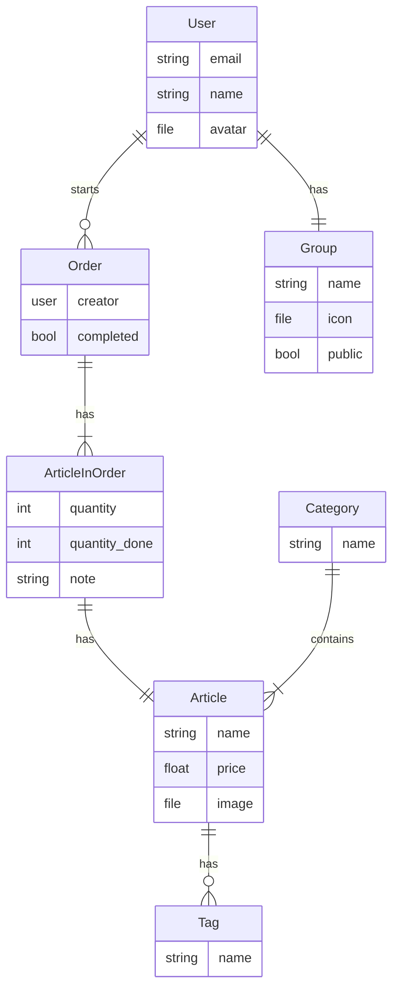

# snacctime

## Roadmap
- [x] Set up PocketBase
- [x] Create basic database layout (might need some tweaks)
- [x] Create tables in PocketBase
- [x] Setup login
- [ ] Setup user creation
- [ ] Setup CI/CD for android builds
- [ ] Setup basic app functionality
    - [x] Create orders
    - [ ] Add articles to orders
    - [ ] Complete Orders
- [ ] Release V1 :tada:

- [ ] Add Grouping system
- [ ] Add Room information

## Database Layout

